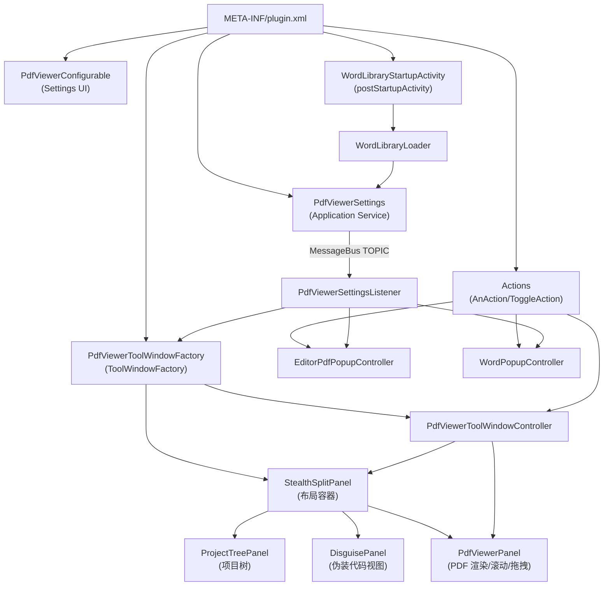

# 02 架构与运行时

## 总体架构（组件图）

该插件以 IntelliJ 的 “声明式入口（plugin.xml）+ Swing UI + MessageBus 配置事件” 为骨架，核心运行时组件如下：

## 运行时主入口：ToolWindow 初始化

入口类：[`PdfViewerToolWindowFactory`](../../src/main/java/com/aiden/plugin/viewpdf/ui/PdfViewerToolWindowFactory.java)

初始化步骤（按代码执行顺序）：

1. 构造 UI 容器：`StealthSplitPanel(project)`，内部创建：
   - `ProjectTreePanel`（左侧）
   - `DisguisePanel`（中间卡片之一）
   - `PdfViewerPanel`（中间卡片之一）
   - `DisguisePanel`（右侧固定代码区）
2. 创建 `PdfViewerToolWindowController`，并放入 `project` 的 `UserData`：
   - key：[`PdfViewerKeys.CONTROLLER_KEY`](../../src/main/java/com/aiden/plugin/viewpdf/PdfViewerKeys.java)
3. 从 `PdfViewerSettings` 读取配置初始化 UI（颜色、比例、缩放、批次渲染页数等）
4. 订阅 `PdfViewerSettingsListener.TOPIC`：
   - 当配置变化时，回调更新 UI/重新渲染 PDF
5. 注册 ToolWindow 标题栏的 ToggleAction：
   - `ToggleThirdPaneAction`：控制右侧代码区显示
   - `ToggleDisguiseAction`：控制伪装/查看 PDF 的切换

## “伪装 ↔ PDF”切换机制

切换发生在 `StealthSplitPanel` 的 `CardLayout`：

- `showDisguise()`：显示伪装卡片，并保存当前 PDF 阅读位置
- `showPdf()`：显示 PDF 卡片，并启动 “离开 PDF 区域自动回退” 的定时检测

触发切换的入口主要有两类：

1. ToolWindow 标题栏 Toggle：[`ToggleDisguiseAction`](../../src/main/java/com/aiden/plugin/viewpdf/ui/ToggleDisguiseAction.java)
2. 菜单/快捷键 Action：[`ClosePdfViewAction`](../../src/main/java/com/aiden/plugin/viewpdf/actions/ClosePdfViewAction.java)

## 自动显示 PDF（悬停触发）

实现位置：[`StealthSplitPanel`](../../src/main/java/com/aiden/plugin/viewpdf/ui/StealthSplitPanel.java)

- `hoverSeconds < 0`：禁用
- `hoverSeconds == 0`：进入伪装代码区立即切到 PDF
- `hoverSeconds > 0`：启动 `hoverTimer`，超时后切到 PDF，并调用 `autoShowPdfCallback`

`autoShowPdfCallback` 在 ToolWindow Factory 中设置为：

- `splitPanel.getPdfPanel().ensureLoaded(settings.getPdfPath(), settings.isNightModeEnabled())`

## PDF 渲染与性能策略

实现位置：[`PdfViewerPanel`](../../src/main/java/com/aiden/plugin/viewpdf/ui/PdfViewerPanel.java)

核心点：

- 使用 PDFBox：`Loader.loadPDF(file)` + `PDFRenderer.renderImageWithDPI(...)`
- 批量渲染：`pagesPerBatch`（默认 50），滚动接近底部（阈值 `NEXT_BATCH_THRESHOLD_PX`）自动请求下一批
- Night Mode：如果 `currentNightMode` 为真，会对渲染后的 RGB 图片做 tone-map（`toToneMap`）
- 阅读位置：
  - `setReadingPositionHandlers(loader, saver)` 由外部注入
  - ToolWindow 模式：持久化到 `PdfViewerSettings.pdfReadPositions`
  - 编辑器 Popup 模式：保存到 controller 内存 `sessionReadPositions`
- 防抖/并发安全：
  - `loadSeq` 自增，用于丢弃过期渲染结果
  - 使用 `SwingWorker` 在后台渲染图片

## 编辑器浮动 PDF 弹框

实现位置：[`EditorPdfPopupController`](../../src/main/java/com/aiden/plugin/viewpdf/popup/EditorPdfPopupController.java)

特性：

- 入口 Action：[`ShowEditorPdfPopupAction`](../../src/main/java/com/aiden/plugin/viewpdf/actions/ShowEditorPdfPopupAction.java)
- 使用 `JBPopupFactory` 创建 popup（可 resize、可点击外部关闭）
- Ctrl+拖拽移动窗口（拖拽监听挂在 contentPanel 和 pdfPanel 区域）
- 透明度：`Window#setOpacity`（异常捕获以兼容不同平台能力）
- 订阅 Settings 变化（如 PDF 路径变化、缩放变化、颜色变化、透明度变化等）

## 背单词悬浮框

实现位置：[`WordPopupController`](../../src/main/java/com/aiden/plugin/viewpdf/popup/WordPopupController.java)

特性：

- 入口 Action：[`ToggleWordPopupAction`](../../src/main/java/com/aiden/plugin/viewpdf/actions/ToggleWordPopupAction.java)
- 展示内容由 Settings 控制（释义/例句/同近义及数量限制）
- 右键菜单：标记当前单词已学会/未学会（通过 `PdfViewerSettings.toggleWordMastered`）
- Ctrl+拖拽移动窗口，并将窗口 bounds 回写到 Settings（形成 “位置/大小/字体” 的持久化）

