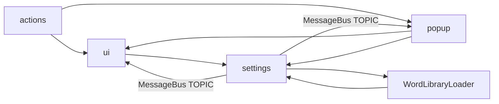

# 08 依赖关系

## 外部依赖（Gradle）

构建脚本：[`build.gradle.kts`](../../build.gradle.kts)

### IntelliJ Platform

工程使用 IntelliJ Platform Gradle Plugin 来拉取目标 IDE 与插件开发所需依赖：

- `intellijPlatform { create("IC", "2025.1") }`
- `sinceBuild = "251"`

这决定了：

- 编译期 API 来源（IntelliJ Platform SDK）
- `runIde` 启动的沙盒 IDE 版本
- `buildPlugin` 打包的兼容范围（sinceBuild）

### PDF 渲染

- `implementation("org.apache.pdfbox:pdfbox:3.0.2")`

在 [`PdfViewerPanel`](../../src/main/java/com/aiden/plugin/viewpdf/ui/PdfViewerPanel.java) 中使用：

- `org.apache.pdfbox.Loader`
- `org.apache.pdfbox.pdmodel.PDDocument`
- `org.apache.pdfbox.rendering.PDFRenderer`

## 内部依赖（包之间）

### 包级依赖关系

说明：

- `actions` 不直接依赖具体 UI 组件，而是通过 `Project UserData` 上的 controller 来间接操作 ToolWindow
- `settings` 通过 `MessageBus` 广播变更事件，使 `ui/popup` 与配置保持同步
- `WordLibraryLoader` 负责“由 Settings 推导出词池”，并写回 `PdfViewerSettings.wordEntries`

### 关键引用点（跨模块）

#### Project UserData

文件：[`PdfViewerKeys`](../../src/main/java/com/aiden/plugin/viewpdf/PdfViewerKeys.java)

- `PdfViewerToolWindowFactory` 写入：
  - `project.putUserData(CONTROLLER_KEY, controller)`
- `ClosePdfViewAction` / `ScrollPdfUpAction` 等读取：
  - `project.getUserData(CONTROLLER_KEY)`

Popup controller 同理：

- `EditorPdfPopupController.getOrCreate(project)`：缓存到 `EDITOR_POPUP_CONTROLLER_KEY`
- `WordPopupController.getOrCreate(project)`：缓存到 `WORD_POPUP_CONTROLLER_KEY`

#### MessageBus（配置变更）

文件：[`PdfViewerSettingsListener`](../../src/main/java/com/aiden/plugin/viewpdf/settings/PdfViewerSettingsListener.java)

- 发布者：[`PdfViewerSettings`](../../src/main/java/com/aiden/plugin/viewpdf/settings/PdfViewerSettings.java)
- 订阅者：
  - ToolWindow：[`PdfViewerToolWindowFactory`](../../src/main/java/com/aiden/plugin/viewpdf/ui/PdfViewerToolWindowFactory.java)
  - Editor PDF Popup：[`EditorPdfPopupController`](../../src/main/java/com/aiden/plugin/viewpdf/popup/EditorPdfPopupController.java)
  - Word Popup：[`WordPopupController`](../../src/main/java/com/aiden/plugin/viewpdf/popup/WordPopupController.java)

## “依赖方向”建议（便于后续扩展）

如果后续要新增功能，推荐延续当前工程的依赖方向：

- 新功能入口：优先放在 `actions`（菜单/快捷键）
- 新 UI：放在 `ui` 或 `popup`，并通过 controller/userData 暴露最小操作面
- 新配置：新增到 `PdfViewerSettings.StateData`，通过 `PdfViewerSettingsListener` 增加事件（必要时）
- 避免 action 直接持有 Swing 组件引用，减少生命周期/泄漏风险

